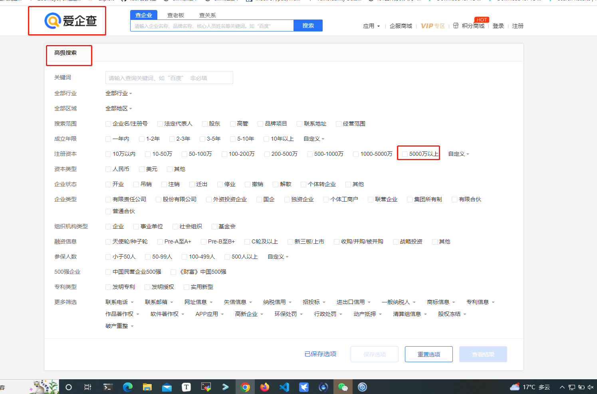
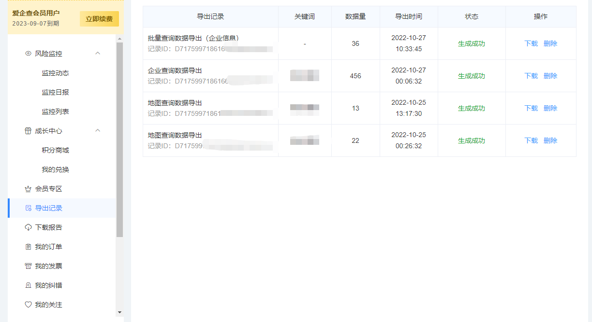
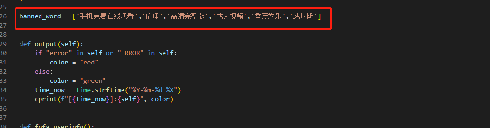
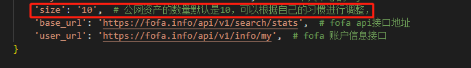
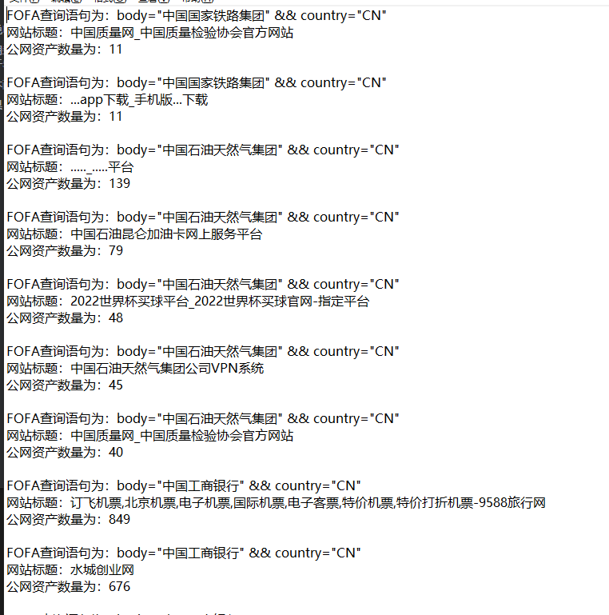
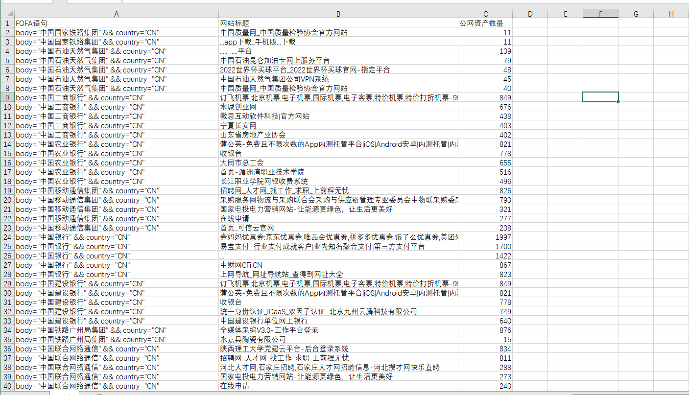

# 使用说明

配合爱企查和fofa实现注册资本大于5000w公司的公网通用资产查询搜索，方便证书挖掘

## 使用爱企查筛选出来注册资本大于5000w的公司

 

然后将结果导出来

 

在导出记录中下载即可

## 脚本配置

首先安装依赖

```
pip3 install -r requirements.txt
```

启动命令

``` 
python3 bat -f 文件名.xls
```

fofa会员配置

```
config = {
    'email': '',  # fofa的登录邮箱
    'key': '',  # fofa个人中心的key
    'size': '10',  # 公网资产的数量默认是10，可以根据自己的习惯进行调整，
    'base_url': 'https://fofa.info/api/v1/search/stats',  # fofa api接口地址
    'user_url': 'https://fofa.info/api/v1/info/my',  # fofa 账户信息接口
}
```


## 结果

其中程序内置有关键词过滤

 

可以根据自己的习惯进行修改，配置。其中保存导出的数据结果是公网资产大于10的，当然了也可以自己修改

 

系统会自动生成结果文件，保存的文件为result.txt和result.csv两种文件格式，方便大家筛选数据

 

 
